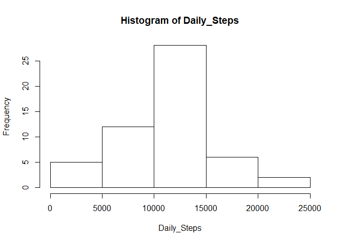
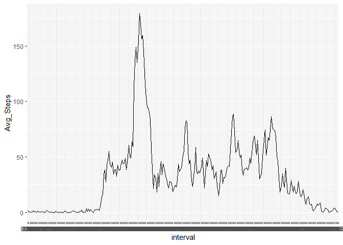
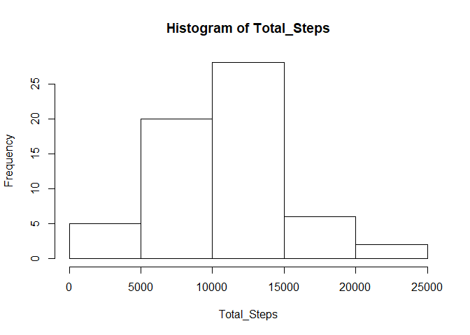
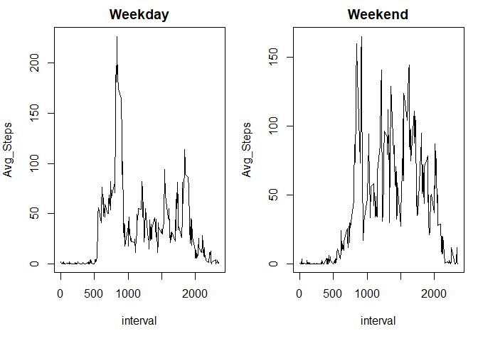

Loading and preprocessing the data
==================================

Reading in the dataset, adding a Date/Time column
-------------------------------------------------

    df <- read.csv('activity.csv') %>% 
            dplyr::mutate(interval = as.character(interval),
                          interval = stringr::str_pad(interval, 4, side = c("left"), pad = "0"),
                          Date_Time = paste(date, interval, sep = " "),
                          Date_Time = as.POSIXct(Date_Time, format = "%Y-%m-%d %H%M"))

What is mean total number of steps taken per day?
=================================================

Creating dataframe calculating the total number of steps each day
-----------------------------------------------------------------

    df_Daily <- dplyr::group_by(df, date) %>% 
            dplyr::summarise(Daily_Steps = sum(steps)) %>% 
            dplyr::ungroup()

Histogram of the total number of steps taken each day
-----------------------------------------------------

    with(df_Daily, hist(Daily_Steps))

Mean and median number of steps taken each day
----------------------------------------------

    x <- with(df_Daily, mean(Daily_Steps, na.rm = TRUE))
    y <- with(df_Daily, median(Daily_Steps, na.rm = TRUE))

### The mean number of steps is 1.076618910^{4} and the median number of steps is 10765

What is the average daily activity pattern?
===========================================

Creating a dataframe calculating the average amount of steps per interval
-------------------------------------------------------------------------

    df_Interval <- dplyr::group_by(df, interval) %>% 
            dplyr::mutate(steps = ifelse(is.na(steps), 0, steps)) %>% 
            dplyr::summarise(Avg_Steps = mean(steps)) %>%
            dplyr::ungroup()

Time Series Plot of the 5-minute Intervals
------------------------------------------

    ggplot2::ggplot(data = df_Interval, aes(x = interval, y = Avg_Steps, group = 1)) + geom_line()

Which interval has the highest average
--------------------------------------

    z <- df_Interval %>% dplyr::filter(Avg_Steps == max(Avg_Steps))

### The ime interval with the most average steps was 0835 with and average of 179.1311475 steps

Imputing missing values
=======================

Calculate and report the total number of missing values in the dataset (i.e. the total number of rows with NA)
--------------------------------------------------------------------------------------------------------------

    sum(!complete.cases(df))

    ## [1] 2304

Used the average steps in an interval to fill in NA values and created a new dataframe equal to the orginal.
------------------------------------------------------------------------------------------------------------

    df_NA <- df %>% dplyr::left_join(., df_Interval, by = 'interval') %>% 
            dplyr::mutate(steps = ifelse(is.na(steps), Avg_Steps, steps)) %>% 
            dplyr::select(-Avg_Steps)

Histogram of the total number of steps taken each day after missing values are imputed
--------------------------------------------------------------------------------------

    df_NA1 <- dplyr::group_by(df_NA, date) %>% 
            dplyr::summarise(Total_Steps = sum(steps))

    with(df_NA1, hist(Total_Steps))

Mean and median number of steps taken each day
----------------------------------------------

    x1 <- with(df_NA1, mean(Total_Steps, na.rm = TRUE))
    y1 <- with(df_NA1, median(Total_Steps, na.rm = TRUE))

### The mean number of steps is 1.058101410^{4} and the median number of steps is 1.039510^{4}

Are there differences in activity patterns between weekdays and weekends
========================================================================

Created a new dataframe with variable saying either Weekend or weekday
----------------------------------------------------------------------

    library(timeDate)

    df_Weekend <- dplyr::mutate(df_NA, date = as.Date(date, "%Y-%m-%d"),
                                new_var = ifelse(isWeekday(df$date, wday=1:5), "Weekday", "Weekend")) %>% 
            dplyr::group_by(new_var, interval) %>% 
            dplyr::summarise(Avg_Steps = mean(steps)) %>% 
            dplyr::ungroup()

Panel plot comparing the average number of steps taken per 5-minute interval across weekdays and weekends
---------------------------------------------------------------------------------------------------------

    par(mfrow = c(1, 2), mar = c(5, 4, 2, 1))

    with(subset(df_Weekend, new_var == "Weekday"), plot(x = interval, y = Avg_Steps, main = "Weekday", type = 'l'))

    with(subset(df_Weekend, new_var == "Weekend"), plot(x = interval, y = Avg_Steps, main = "Weekend", type = 'l'))

